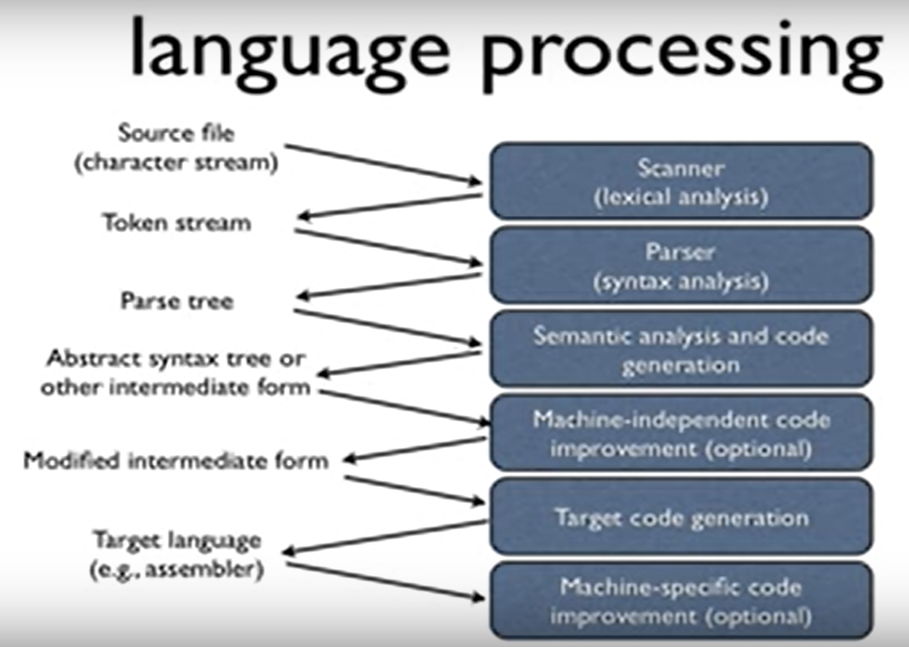
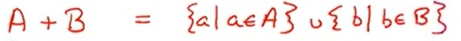
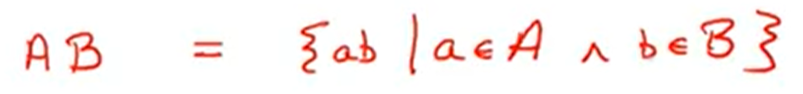
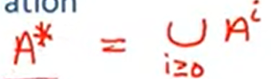

youtube : https://www.youtube.com/watch?v=wCNSvnXIX84&list=PLDcmCgguL9rxPoVn2ykUFc8TOpLyDU5gx&index=9

# 3.3| Regular Languages -- 正则语言

如何用正则语言描述字符串？

正则表达式用于描述正则语言

* 正则语言由5个要素构成

1. 空串

Epsilon -- 

2. 单个字母组成的子串

Single character -- 比如： 'c' = {"c"}

3. 并

Union --

4. 乘积

Concatenation(级联) --

5. n次幂

Iteration --
