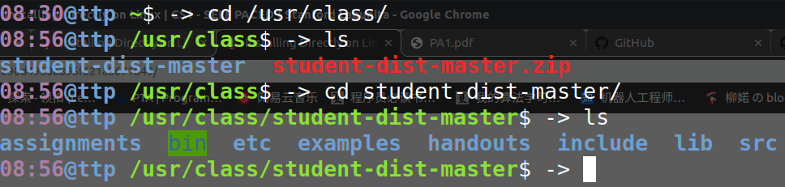

`https://lagunita.stanford.edu/courses/Engineering/Compilers/Fall2014/6b750292e90d4950b895f621a5671b49/`

任务1配置环境有两种方式，使用虚拟机，或者就在本机上下载文件。

不过不管哪种方式都逃不了Linux，这里我用的ubuntu，是一个linux的相当受欢迎的发行版，大家如果还没有用过ubuntu的装一个试试吧，不要逃避了。

关于安装ubuntu，我有一些建议：

1. 安装的版本尽量新一点，我安装的是`Ubuntu 18.04 LTS`，个人感觉比`16.04 LTS`好一点。
2. 语言推荐选择English，中文有些地方不好用。
3. 下载好镜像文件，制作好启动U盘后，安装哪些应用那里选择最小安装
4. 第二步后马上有选择安装类型，如果是新手安装，然后想是双系统**一定**选择第一个和`Windows Boot Manager`共存，现在网上好多是选其它选项，那就需要自己手动分区，现在的ubuntu自己会分区了，不要选其他选项。


我是用的 `Installing Directly on Linux` 准备这个任务1的。

按照下面的步骤做：

`https://lagunita.stanford.edu/courses/Engineering/Compilers/Fall2014/6b750292e90d4950b895f621a5671b49/`

在做

`wget https://s3-us-west-1.amazonaws.com/prod-edx/Compilers/Misc/student-dist.tar.gz`

貌似不翻墙会404，去github上搜student-dist，有人上传了，下载下来一样。

这是我下载好后的目录。


注意我的bin目录颜色有区别，因为我用`chmod`命令更改了执行权限，ubuntu里面文件权限十分清楚严格，你如果要运行一些文件，就需要把文件权限改为可执行的。要不然就算你`sudo`了，也不能执行。

这个课程的四个任务将引导我们设计一个COOL语言的编译器，这个任务是完成 `lexical analysis` -- 词法分析

然后我参考的这个文档，具体文件去官网找，`The Cool Reference Manual`

hello world!

```
class Main inherits IO {
   main(): SELF_TYPE {
	out_string("Hello, World.\n")
   };
};
```


大致熟悉下COOL语言后，我们要学习`Lex`，官网上也有这方面的文档，当然都是英文的。

词法分析是由函数 `yylex()` 实现的，该函数从输入流中读取`token`并返回其名称（`token class`）。此外，它还将语义值（例如数字）赋给全局变量 `yylval`。

比如：
```
/* regular-expression { action } */

":=" { return ASSIGN; }

[0-9]+ { yylval = atoi(yytext); return NUMBER; }
```