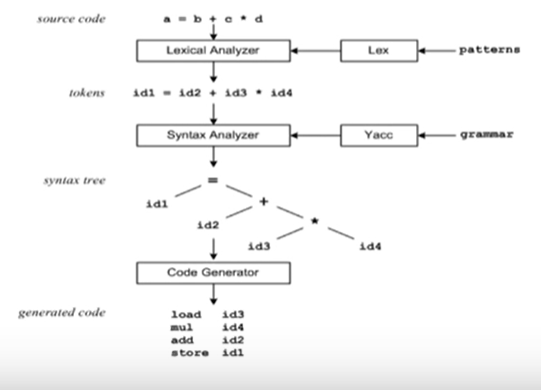
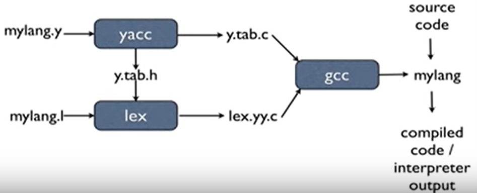

youtube : `https://www.youtube.com/watch?v=54bo1qaHAfk&list=PLkB3phqR3X43IRqPT0t1iBfmT5bvn198Z`

参考网站 ：`https://www.ibm.com/developerworks/cn/linux/sdk/lex/`

youtube这个视频的第二部分是讲yacc/bison，

## yacc/bison是什么？

yacc : yet another compiler compiler

对lex产生的token，进行解析并做语义处理。

bison：GNU的parser，和yacc向上兼容






yacc 三个组成部分：
```
FRIST PART                  // 可选的
%%
production          action  // 模式 行为
....
%%
THIRD PART                  // 可选的
```


## 它如何运作？

...

## 一个简单的程序

...