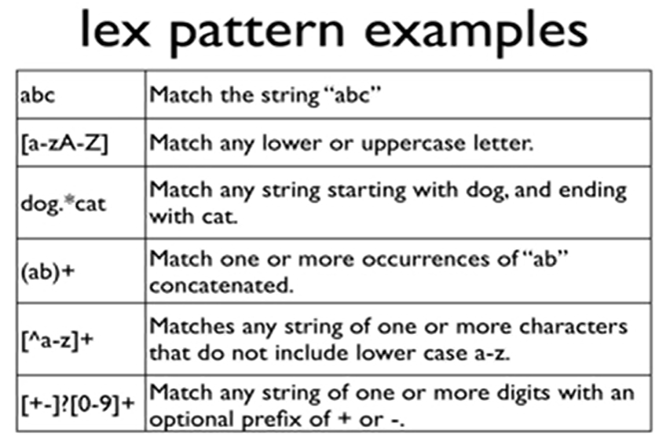

youtube : `https://www.youtube.com/watch?v=54bo1qaHAfk&list=PLkB3phqR3X43IRqPT0t1iBfmT5bvn198Z`

参考网站 ：`https://www.ibm.com/developerworks/cn/linux/sdk/lex/`

这是一个youtube上介绍lex/yacc的视频，讲的超级的好，对于CS143的任务1，我又有了信心。这一篇文章是上面视频的总结和记录，我尽量写得详细点，但是强烈推荐去看看。

如果你给我说不能翻墙，那我只能说，国内搜索引擎都什么呀！有个B站UP主叫LEX，取名字之前不先搜搜吗？不过还是主要是搜索引擎做的不好，加上国内对于计算机底层方面没有计算机应用方面火。所以还是推荐大家试着科学上网。

然后就是这个是linux/unix上的，双系统走一波。

还有需要就是这个不单单对编译原理有用，视频里面举例判断SQL配置文件的程序相当漂亮。

## 简单介绍词法分析


## 什么是LEX?

lex is a scanner generator.

* 输入： 正则表达式和用c语言写的相关联的行为（actions）
* 输出： a table-driven scanner (默认文件名为lex.yy.c)

flex 是原始UNIX上lex工具的一个开源实现。

lex 三个组成部分：
```
FRIST PART                  // 可选的
%%
pattern             action  // 模式 行为
....
%%
THIRD PART                  // 可选的
```

## LEX如何运行?

lex 示例(文件名 ex1.l，传说中的hello world)：

```
%%
"hello world"       printf("GOODBYE\n");    // 将匹配"hello world"，并执行printf
.                   ;                       // 匹配任意字符，忽略其他情况
%%
```

测试上面的代码：

```shell
% lex ex1.l                 // 处理ex1.l生成lex.yy.c
% cc lex.yy.c -ll           // 编译lex.yy.c，-ll抢占main函数
% ./a.out                   // gcc/cc默认输出可执行文件为a.out
hello world
GOODBYE
%
```

lex 常见正则表达式



## lex 如何处理文本配置文件以及集成到c语言？

假如我们有一个配置文件(config.in)：

```
db_type : myset
db_name : testdate
db_table_prefix : test_
db_port : 1099
```

首先定义`scanner.h`用来为每个token进行标记

```c
#define TYPE 1
#define NAME 2
#define TABLE_PREFIX 3
#define PORT 4
#define COLON 5         // 冒号
#define IDENTIFIER 6
#define INTEGER 7
```

然后定义`scanner.l`

```lex
%{
    #include "scanner.h"
}%

%%

:                   return COLON;
"db_type"           return TYPE;
"db_name"           return NAME;
"db_table_prefix"   return TABLE_PREFIX;
"db_port"           return PORT; 

[a-zA-Z][_a-zA-Z0-9]*  return IDENTIFIER;
[1-9][0-9]*            return INTEGER;
[ \t\n]                ;

.                   printf("unexpected character\n");

%%

/*
    注意这一段必须包括 yywrap() 函数。
    Lex 有一套可供使用的函数和变量。 其中之一就是 yywrap。
    这一函数在文件（或输入）的末尾调用。 如果函数的返回值是1，就停止解析。
*/

int yywarp(void) {
    return 1;
}
```

然后`lex scanner.l`生成`lex.yy.c`文件

然后编写`scanner.c`

```c
#include <stdio.h>
#include "scanner.h"

extern int yylex();     // 这一函数开始分析。 它由 Lex 自动生成。
extern int yylineno;    // 提供当前的行数信息。 （lexer不一定支持。）
extern char* yytext;    // 匹配模式的文本存储在这一变量中（char*）。

char *names[] = {NULL,"db_type","db_name","db_table_prefix","db_port"};

int main(void) {
    int ntoken, vtoken; // name & value
    ntoken = yylex();
    while(ntoken) {     // 结束时返回0
        printf("%d\n",ntoken);
        if(yylex() != COLON) { // 下一个不为分号
            printf("Syntax error in line %d, Except a ':' but found %s\n",yylineno,yytext);
            return 1;
        }   
        vtoken = yylex();
        switch(vtoken){
            case TYPE:
            case NAME:
            case TABLE_PREFIX:
                if(vtoken != IDENTIFIER) {
                    printf("Syntax error in line %d, Except an identifier but found %s\n",yylineno,yytext);
                    return 1;
                }
                printf("%s is set to %s\n",names[ntoken],yytext);
                break;

            case PORT:
                if(vtoken != INTEGER) {
                    printf("Syntax error in line %d, Except an identifier but found %s\n",yylineno,yytext);
                    return 1;
                }
                printf("%s is set to %s\n",names[ntoken],yytext);
                break;

            default:
                 printf("Syntax error in line %d\n",yylineno);
        }

        ntoken = yylex();
    }
    return 0;
}
```

然后`gcc scanner.c lex.yy.c -o scanner`

运行代码`./scanner < config.in`