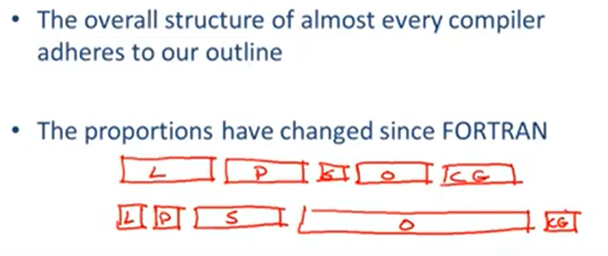

youtube : https://www.youtube.com/watch?v=fYi4XsrmeuE&list=PLDcmCgguL9rxPoVn2ykUFc8TOpLyDU5gx&index=2

# 1.2| Structure of a Compiler -- 编译器结构

## 用英语的方法对编译器结构进行简单介绍。

* 第一步，认识单词 -- 字母以上的最小单元

Lexical Analysis -- 词法分析的目标是将程序的文本划分为“words”和“token”。

* 第二步，明白句子的结构

Parsing = Diagramming Sentence -- 图解句子，这里的“图”是一棵树

* 第三步，明白意思，这对于编译器来说很困难

Semantic Analysis -- 语义分析，编译器执行有限的语义分析来捕获程序的不一致之处（程序是否有歧义、语法错误）

* 第四步，优化，这里有一点像编辑（看成把白话文写成文言文吧 /W\ ）

Optimization -- 优化，让程序运行更快，或者占用更少的内存等等。

* 第五步，翻译成另一种语言（这不是英语白痴的我看懂句子经历的5步吗 (╯°Д°)╯︵ ┻━┻ ）

Code Generation -- 代码生成，翻译成机器码或者其他语言。

几乎每一个编译器都包含这5步，但是从上一节介绍的FORTRAN开始，这5步所占比重却发生了改变。

图片上面的是传统的编译器，语义分析比重较小，其他比较平衡。
图片下面的是现代编译器，代码优化比重非常大，语义分析比重一般，其他几步比重小。（过于真实）