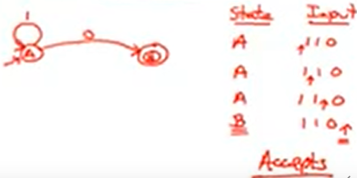

youtube : https://www.youtube.com/watch?v=a-Pntm_dgIw&list=PLDcmCgguL9rxPoVn2ykUFc8TOpLyDU5gx&index=14

# 4.2| Finite Automata -- 有穷自动机

本节主要讲了：如何用有穷自动机实现正则表达式

* Finite Automata用于等价地实现正则表达式

* Finite Automata组成：

An input alphabet -- 字母表E

A finite set of states -- 有限的状态集合S

A start states -- 开始状态n

A set of accepting states -- 终止状态

A set of transitions -- 状态转换

* 有穷自动机的图示：

* language of a FA = set of accepted strings -- 有穷自动机对应的语言：其接收的字符串组成的集合

比如：

`epsilon move` 空转换，不用输入就可以从状态A转换到状态B

* DFA 确定型的有穷自动机

1. 一个输入对应一个确定的状态转换（即一个确定的输入不会转换到两个状态）

2. 没有空转换

* NFA 非确定型的有穷自动机

1. 一个输入可以同时对应多个状态转换

2. 可以有空转换

