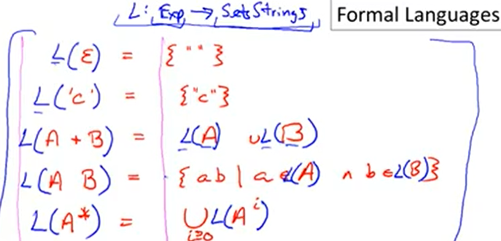

youtube : https://www.youtube.com/watch?v=za5NazQtzIY&list=PLDcmCgguL9rxPoVn2ykUFc8TOpLyDU5gx&index=10

# 3.4| Formal Languages -- 形式语言

* 形式语言：由字母表构成的串

Meaning Function L: Regular Expressions->Set Strings（一个将正则表达式映射为字符串集合的函数）

Meaning is many to one -- 多对一的，永远不会一对多。
