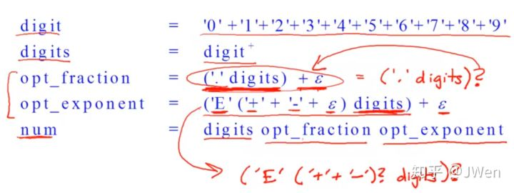

youtube : https://www.youtube.com/watch?v=CZOXHGDw_kU&list=PLDcmCgguL9rxPoVn2ykUFc8TOpLyDU5gx&index=11

# 3.5| Lexical Specifications -- 词法规则

* 如何用正则语言描述词法规则

* keyword关键词: 'if' 'else' 'then'

其中'if' == 'i''f'

* integer整数: 非空digit串

digit = '0'+'1'+...+'9' （表示一位数字）

integer = digit digit* = digit+ （digit digit*表示非空的整数，简写为digit+）

* identifier标识符：

letter = [a-z A-Z] （letter = 'a'+'b'+...+'z'+'A'+...+'Z'的简写）

identifier = letter(letter+digit)* （字母开头，由letters或者digits组成）

* whitespace空白:

whitespace = ( ' ' + '\n' + '\t' )+

* PASCAL中浮点数的正则定义:

红色标出的是对于+Epsilon的一种简写方式。

