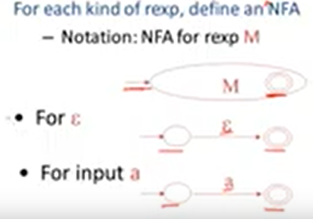

youtube : https://www.youtube.com/watch?v=a-Pntm_dgIw&list=PLDcmCgguL9rxPoVn2ykUFc8TOpLyDU5gx&index=14

# 4.3| Regular Expressions into NFAs -- 正则表达式转换为NFAs

Lexical specification --> Regular Expression --> NFA --> DFA --> Table-driven Implementation of DFA

(词法规范 --> 正则表达式 --> 不确定的有穷自动机 --> 确定的有穷自动机 --> 一组查询表和一些遍历表的代码) 

前面的部分完成了前两步，定义了NFA、DFA。（瞬间明朗了haha...）

对于每一个正则表达式，定义NFA、以及空字符和字符a如下：

那么(好秀呀！)：

