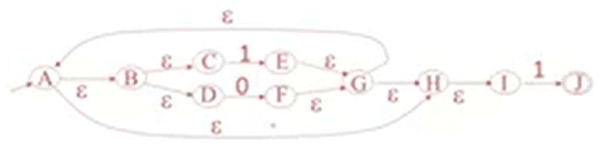
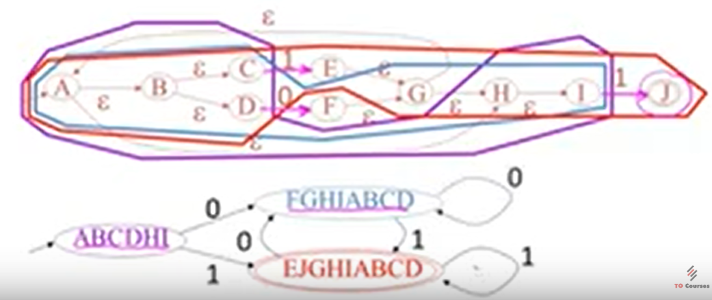
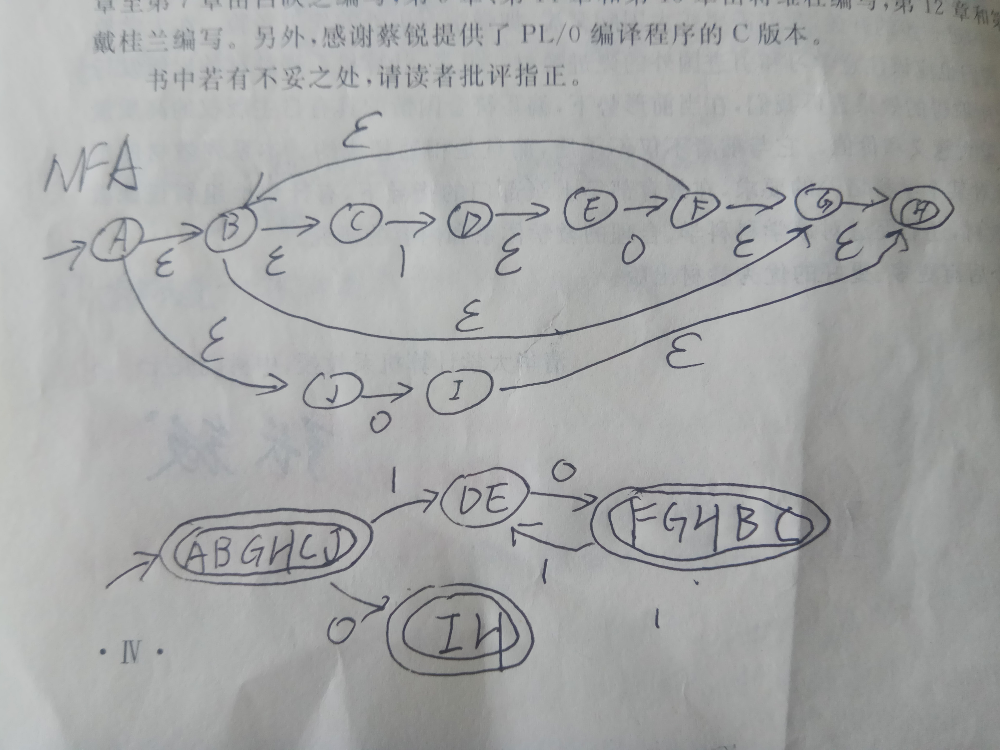

youtube : https://www.youtube.com/watch?v=a-Pntm_dgIw&list=PLDcmCgguL9rxPoVn2ykUFc8TOpLyDU5gx&index=14

# 4.4| NFA to DFA -- NFA to DFA

(上课是真滴没听懂这一块QAQ)

* `epsilon closure` -- 从某状态通过空转换可达到的所有状态的集合

* NFA

起始状态：A

转换得到的状态：a(X)=从X出发由输入a能达到的所有状态

终止状态：F

* 从NFA转换到DFA

起始状态：epsilon closure(A)

转换得到的状态：X-a->Y if Y = epsilon closure(a(X)) (意思就是从X转换到一个状态集，包含所有从X出发，经过空转换或或其他转换能到达的状态)

终止状态：只要当前状态集中包含F，就是终止状态

* 简单来说：NFA一个输入可以转换到不同状态，DFA一个输入转换到一个唯一的状态集（包含不同状态）

比如 `(1+0)*1` NFA表示如下：

步骤：
1. 从A（起始状态）开始，找出epsilon closure(A) = ABCDHI，作为DFA的起始状态。（如下图，紫色圈出）

2. 可能的转换是'1'或者'0'，从'0'开始可以到达F，那么求epsilon closure(F) = FGHIABCD。（如下图，深蓝色圈出）

3. 从'0'开始可以到达E或者J，那么求epsilon closure(E) + epsilon closure(F) = ABCDEGHIJ，因为包含J，所以说终止状态。（如下图，红色圈出）

4. 对红圈、深蓝圈继续上面的步骤。

练习(字母我自己标的，不一定正确，结果是正确的)：

