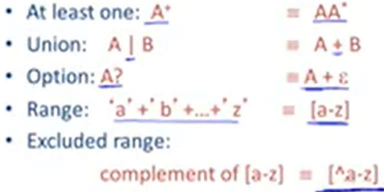

youtube : https://www.youtube.com/watch?v=okqzkJPBIhc&list=PLDcmCgguL9rxPoVn2ykUFc8TOpLyDU5gx&index=14&t=11s

# 4.1| Lexical Specification -- 词法规则

## 回顾：



## 如何识别任意字符串是否属于某一语言

1. 写出所有token class的正则表达式

比如：
Number = ‘digit'
Keyword = 'if'+'else'+...
identifier = letter (letter+digit)*
OpenPar = '('

2. Lexical Speicification R = 所有token class的并

R = Keyword + identifier + Number + ...
  = r1 + r2 + r3 + ...

3. 输入字符串x1...xn，针对字符串的某个前缀（即子串），判断其是否属于L(R)

```
    for 1 <= i <= n 检查
        x1...xi 属于 L(R)
```

4. 如果3成立，那么x1...xi就属于L(R)，否则x1...xi不属于L(R)

```
    x1...xi 属于 L(Rj) 成立对于一些j
```

5. 将x1...xi从x1...xn中删除，转入3继续判断，直到x为空（哦，原来如此，有点神奇呀！）

## 避免以上流程中的二义性：

1. 总是选择最大的前缀x1...xi（maximal match）

比如： ’==‘ 不会看成两个 ’=‘

2. 对给定前缀x1...xi，匹配其对应的token class中优先级最大的那个（正想问呢）

比如： 'if'可能属于identifier或者keyword，此时优先识别为identifier

3. 设定error集合，表示不属于该语言的字符串。若输入此类字符串，则报错（好像很严谨耶，都是大神 /W\ ）

将Error放到最后（优先级最低），因为可能我们定义的Error太草率，和前面的正确的正则表达式有重合。

