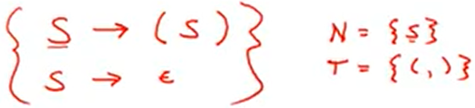
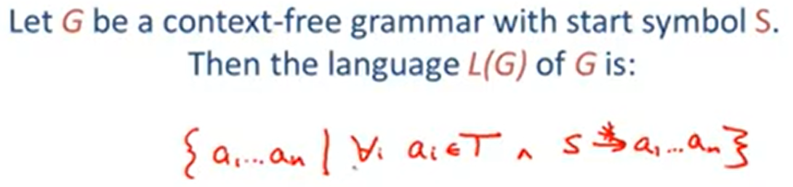

# 5.2| Context-Free Grammars -- 上下文无关文法

( 好吧，上课也没太听懂这一块:P )

CFG（上下文无关文法）回答了一个字符串是否属于某语言。

CFG的组成：

1. A set of terminals 终止符 T
2. A set of non-terminals 非终止符 N
3. A start symbol 开始符 S (S 属于 N)
4. A set of productions 生成式 (非终止符non-terminal -> 终止符terminal)

举例：





举例，简单的算术运算：

```
E -> E + E
  |  E * E
  |  (E)
  |  id
```

