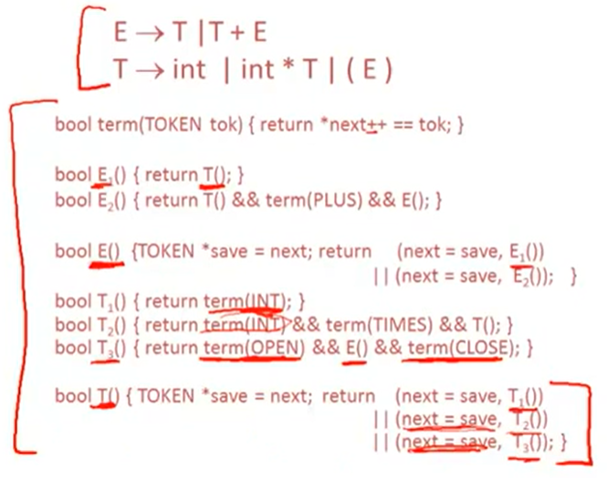

# 6.4| Recursive Descent Algorithm -- 递归下降算法

* 假设token为：INT,OPEN,CLOSE,PLUS,TIMES

* 假设全局变量next指向下一个token

* 定义boolean函数，核对是否匹配

一个给定的token terminal(终结符)

```cpp
bool term(TOKEN tok){ return *next++ == tok;}
```

S的第n个产生式

```cpp
bool Sn() {...}
```

S的所有产生式

```cpp
bool S() {...}
```

---

比如：

对于产生式 E -> T
```cpp
bool E1() { return T(); }
```
对于产生式 E -> T + E
```cpp
bool E2() { return T() && term(PLUS) && E(); }
```
对于E的所有产生式（太简洁漂亮了吧(～￣▽￣)～）
```cpp
bool E() { 
    TOKEN *save = next;
    return (next = save,E1())
        || (next = save,E2());
}
```

最终结果：




