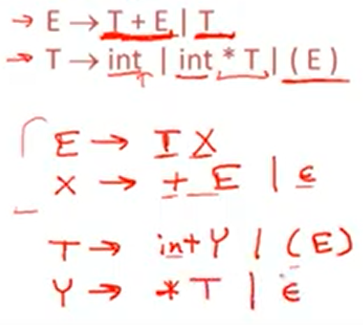
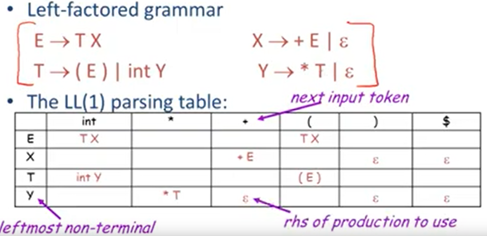
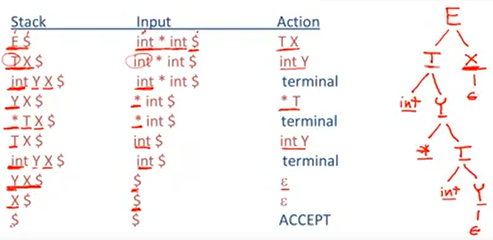

# 7.1| Predictive Parsing -- 预测分析

预测分析和递归下降类似，但可以预测使用哪一个产生式

LL(k): 第一个L表示从左向右扫描，第二个L表示最左推导，k个token lookahead (K = 1)



语法分析表，先暂时不用管如何得到这张表的。

* 行 对应 最左的非终结符
* 列 对应 下一个输入符
* 数据 对应 生成式（如果数据为空，则出错）



```
initialize stack = <S $> and next   # 初始化栈为S和$(代表输入结束)
repeat
    case stack of
        <X,rest> : if T[X,*next] = Y1...Yn
                    then stack <- <Y1...Yn rest>;
                    else error();
        <t,rest> : if t == *next++
                    then stack <- <rest>;
                    else error();
until stack == < >
```

举例：




