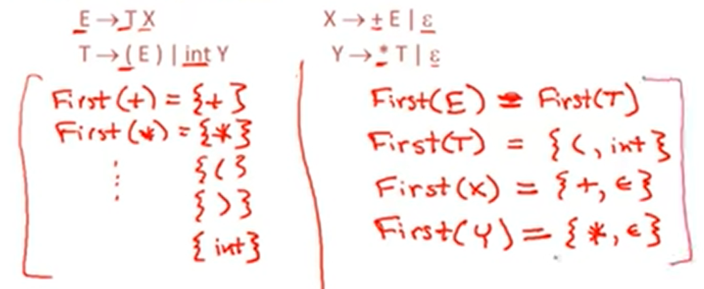

# 7.2| First Sets -- FIRST集合

百度了一下三个集合：

First（A）集的作用是标示在替换非终结符A的时候，替换后的文法的首字母集合，语法分析程序根据这个来判断给定的语言是否是合法的，是符合规则的。

Follow（A）的作用是标示那些可以出现在A之后的字符，语法分析程序根据这个，在A可以被替换为e（空）的时候来进行判断，看当前的文法是否是合法的。

这里简单说明下，比如A->b,A->e(空) 当给定的语言是 bXXXXX的时候，根据第一句文法就可以判定句子合法，但是如果给的语言是cXXXXX的时候，因为A->可以替换为空，这时候就需要一句A的follow集来进行判断，若A的follow集里面含有c 则语言是合法的

Select集的作用是将first集和follow集进行合并，如果两个文法的左端都是A，若他们的select集交集为空，表明他们是两个无关的，不会产生不确定性的文法，反之，则表明文法不是LL(1)文法

---

求解的时候考虑下空就行了，可以看到`FIRST(E) = FIRST(T)`那里的等号之前是属于符号，
意思是根据`E->TX`可以推出`FIRST(T)属于FIRST(E)`，而且如果T的FIRST包含空时，`FIRST(X)也属于FIRST(E)`，但是并不包含空，所以`FIRST(E) = FIRST(T)`。

即：

如果 X 是非终结符号，且 X -> Y1Y2Y3…Yk 是产生式

* 如果a在FIRST(Yi)中，且 ε 在FIRST(Y1)，FIRST(Y2)，…，FIRST(Yi-1)中，那么a也在FIRST(X)中。

* 如果ε 在FIRST(Y1)，FIRST(Y2)，…，FIRST(Yk)中，那么ε在FIRST(X)中；

其他可参考题解：`https://www.jianshu.com/p/210fda081c76`

