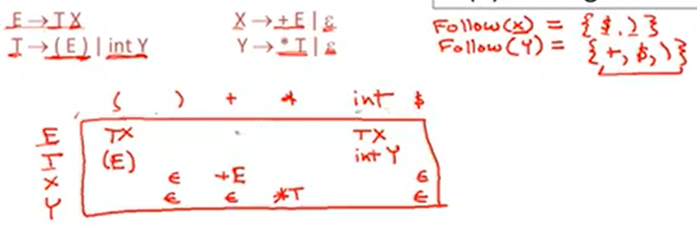

# 7.4| LL1 Parsing Tables -- LL1分析表

构造分析表T的算法是：
(1) 对文法G的每个产生式A->a执行第二步和第三步;
(2) 对每个终结符t∈FIRST(a),T[A,t] = a;
(3) 若ε∈FIRST(a),则把任何b∈FOLLOW(A) T[A,b] = a;
(4) 把所有无定义的T[A,a]标上出错标志.

对于`S -> Sa|b`，可以得到`First(S) = {b}`和`Follow(S) = {$,a}`

那么分析表的`T[S,b] = b`或者`T[S,b] = Sa`，产生了多种选择，不是LL1文法。

不是LL(1)：

* not left factored
* left recursive
* ambiguous
* other grammer

